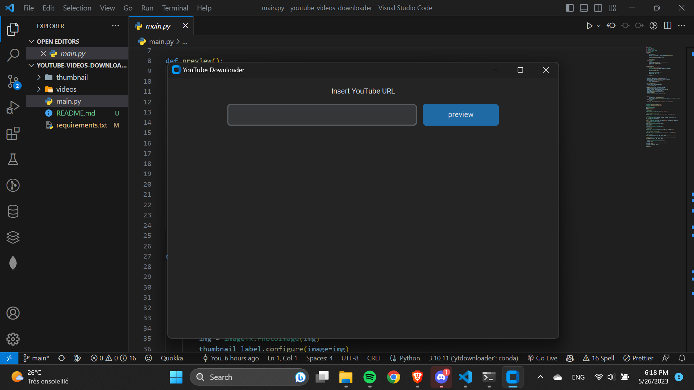
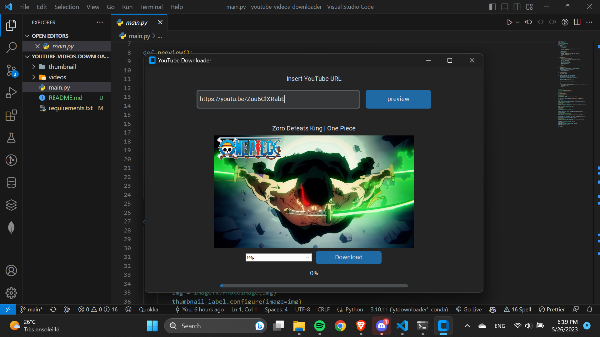

# YTDownloader
A simple youtube downloader made in python using pytube and tkinter.

## Installation
```shell
pip install -r requirements.txt
```

## Usage
```shell
python main.py
```

## Screenshots



